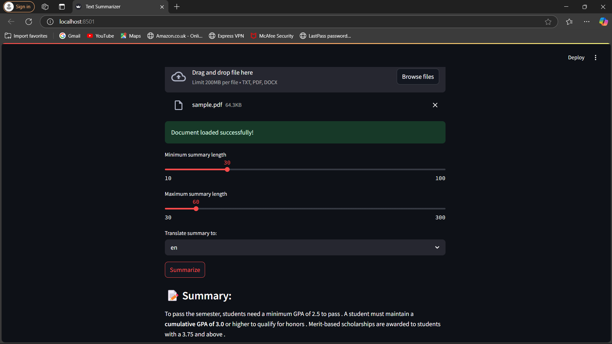

Bidirectional and Auto Regressive Transformer Model

- DATASET for Text Summarization (from HuggingFae):
  https://huggingface.co/datasets/knkarthick/dialogsum

- About BART model:
  https://huggingface.co/facebook/bart-large-cnn

📝 Text Summarization NLP Project

This project performs extractive/abstractive text summarization using Hugging Face Transformers. The model summarizes long-form content into concise summaries using pretrained transformer models.

 Features

- Summarize long articles, paragraphs, or documents
- Uses Hugging Face `transformers` pipeline
- Easily switch between multiple models (`BART`, `T5`, etc.)
- Lightweight options available for faster inference
- 
Setup

Install Requirements
pip install -r requirements.txt

Models You Can Use

facebook/bart-large-cnn	
facebook/bart-base	
sshleifer/distilbart-cnn-12-6	
t5-small	Small	⚡ Very Fast	Moderate

from transformers import AutoTokenizer, AutoModelForSeq2SeqLM
tokenizer = AutoTokenizer.from_pretrained("sshleifer/distilbart-cnn-12-6")
model = AutoModelForSeq2SeqLM.from_pretrained("sshleifer/distilbart-cnn-12-6")

Directory Structure
Text-Summarization-NLP-Project/
│
├── main.py
├── summarization.ipynb           
├── requirements.txt
├── README.md                    
└── src/
    └── textSummarizer/
        └── pipeline/
        └── conponents/

Running the Project
Jupyter Notebook
jupyter notebook summarization.ipynb
Python Script

python main.py

python
from transformers import pipeline
summarizer = pipeline("summarization", model="sshleifer/distilbart-cnn-12-6")
text = "Your input paragraph goes here..."
summary = summarizer(text, max_length=120, min_length=30, do_sample=False)
print(summary[0]['summary_text'])

Requirements

Python 3.8+
transformers
datasets
torch

Installations:

pip install transformers datasets torch

## 📸 Screenshot

## Sample Output



